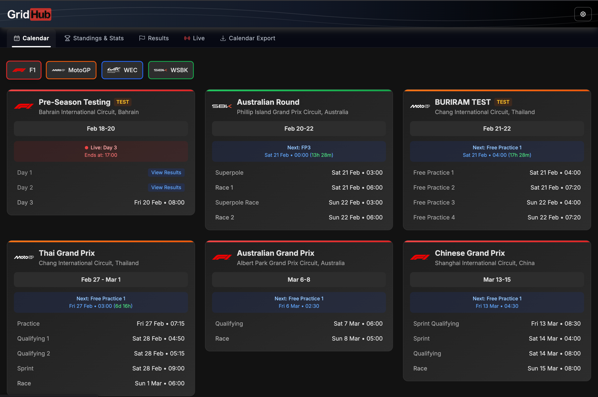
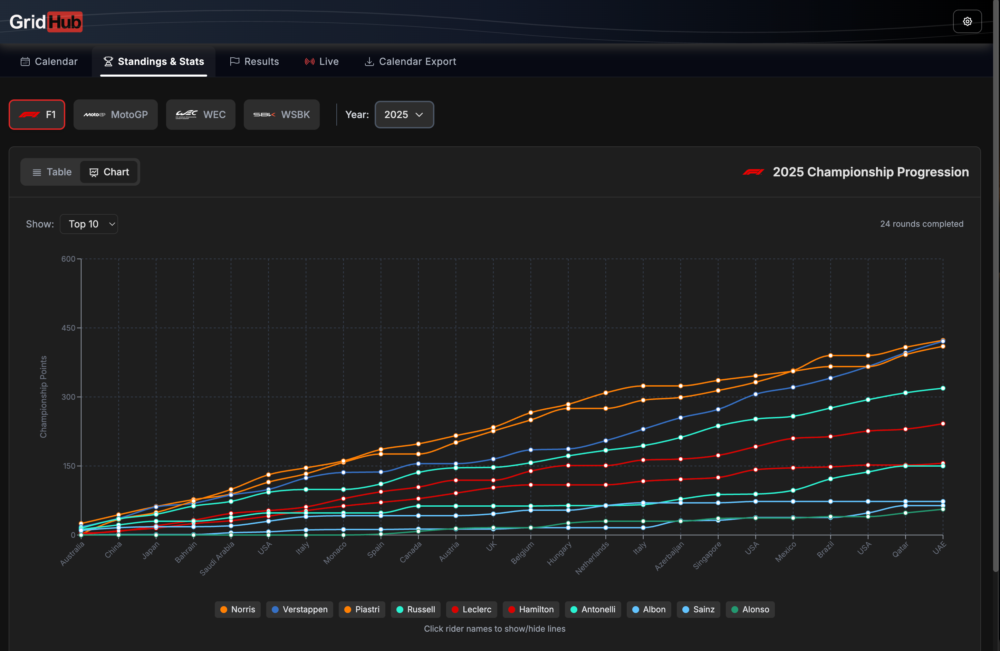
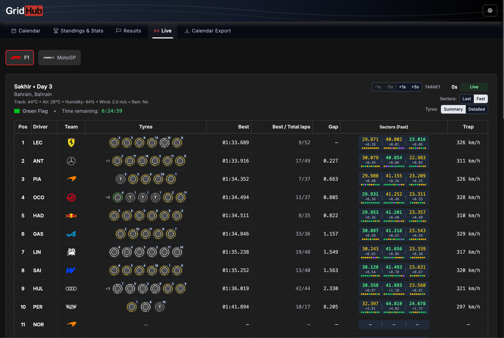

# GridHub

A unified racing calendar for **Formula 1**, **MotoGP**, **WEC**, and **WorldSBK** — all in one place.

**[gridhub.one](https://gridhub.one)** · See what's new in the [Changelog](CHANGELOG.md)

## Screenshots

  
  
  

## Features

- **Unified calendar** — See upcoming races across all series in chronological order, with list and calendar views
- **Live timing** — Real-time race positions, tyre strategies, sector times, and gap data during F1 and MotoGP sessions
- **Race results** — Full session results for every race weekend, including practice, qualifying, sprint, and main race
- **Championship standings** — Current and historical standings with multi-year support
- **Weekend schedules** — Detailed session times with weather forecasts, organized by day
- **Track information** — Circuit maps, lap counts, track length, and previous winners
- **Calendar export** — Download or subscribe to your racing schedule as an .ics file, with optional reminders (10min, 30min, 1h, or 24h before each session)
- **Series visibility** — Show or hide individual series to customize your view
- **Social previews** — Dynamic Open Graph images for shared links

> **Tip:** Only follow certain series? Open the settings menu (top right) to hide any series you're not interested in. Your choice is saved across visits.

## Series Covered

| Series | Live Timing | Results | Standings |
|--------|:-----------:|:-------:|:---------:|
| Formula 1 | Yes | Yes | 2015–present |
| MotoGP (incl. Moto2/Moto3) | Yes | Yes | 2013–present |
| WEC | — | Yes | Current year |
| WorldSBK | — | Yes | Current year |

## Tech Stack

**Frontend:** React, TypeScript, Tailwind CSS, Vite, React Router

**Backend:** Node.js, Express, multi-layer caching

**Data sources:** OpenF1 API, Jolpica F1 API, MotoGP Pulse API, WEC API

**Hosting:** Vercel (frontend) + VPS (API server)

## License

This project is source-available. The code is not currently open source.
